# Archive Converter API Architecture

**Version**: 1.0.0
**Updated**: 2025-12-11

---

## 1. System Architecture (Mermaid)

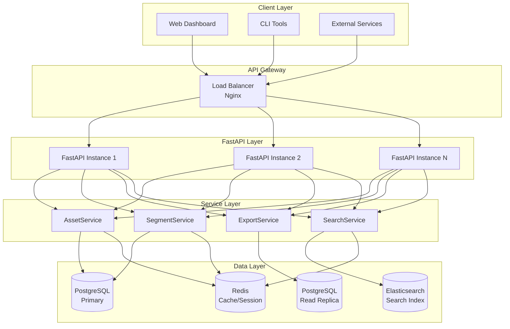

---

## 2. API Request Flow

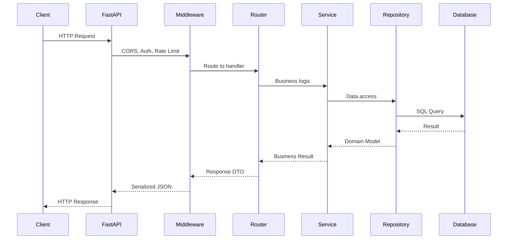

---

## 3. Data Model Conversion Flow

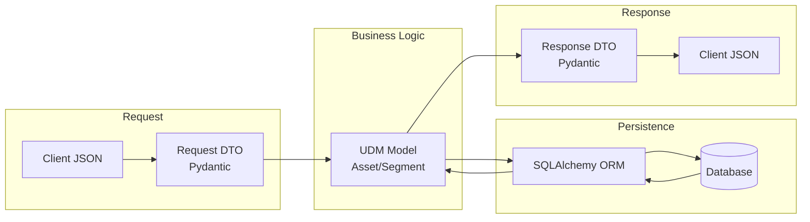

---

## 4. Export Pipeline Architecture

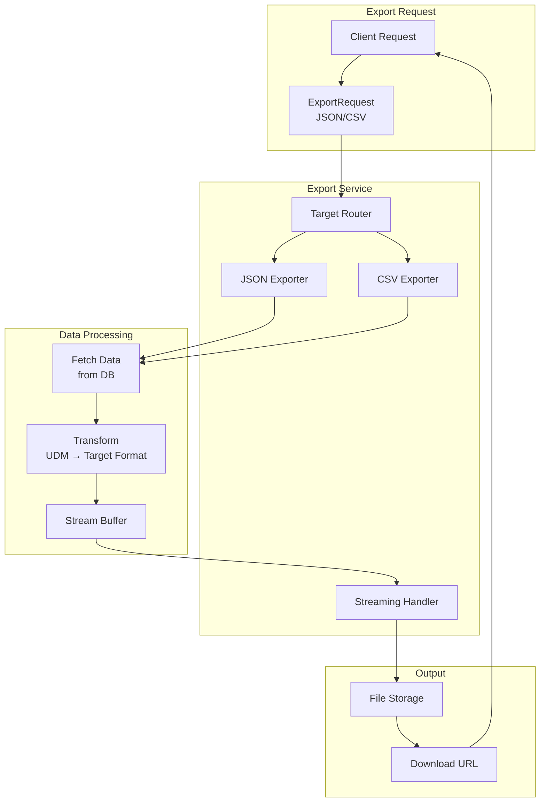

---

## 5. Search Architecture

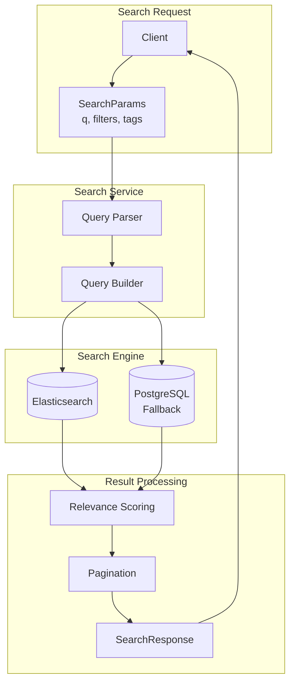

---

## 6. Database Schema (ER Diagram)

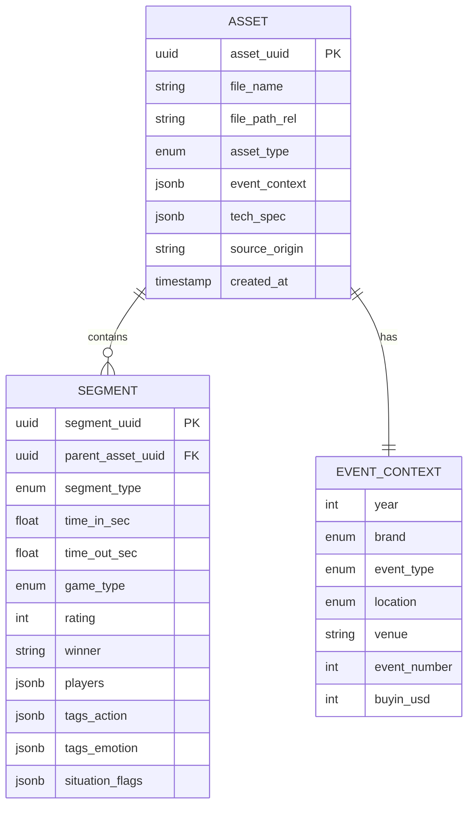

---

## 7. Caching Strategy

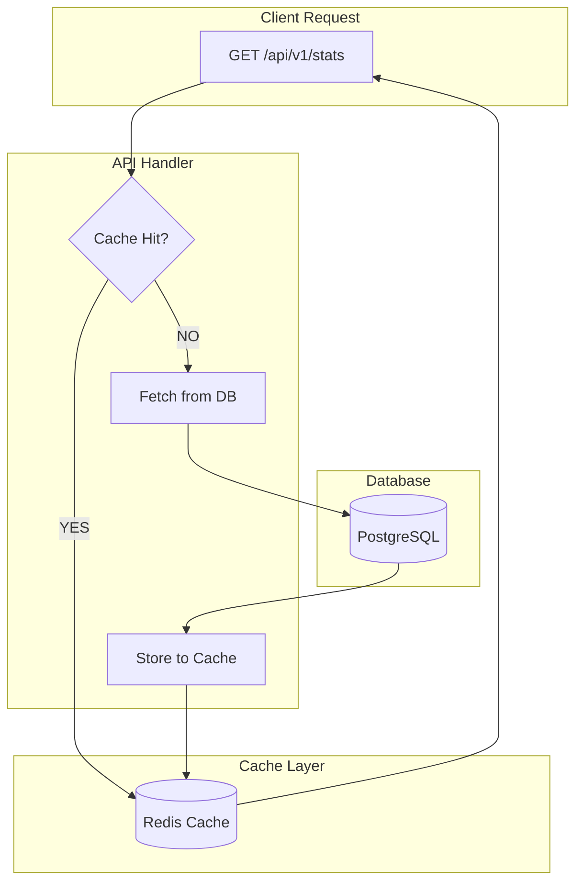

**Cache TTL**:
- 통계 (stats): 5분
- Asset 목록: 1분
- Search 결과: 30초
- Asset 상세: 10분 (rarely changes)

---

## 8. Rate Limiting Strategy

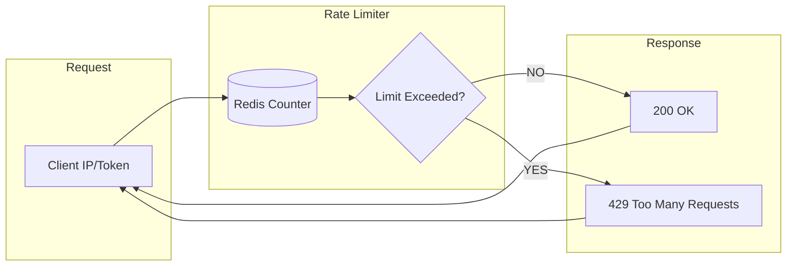

**Rate Limits**:
- 익명: 100 req/min
- 인증: 1000 req/min
- Export: 10 req/hour

---

## 9. Scaling Architecture

### Horizontal Scaling (Load Balancer)

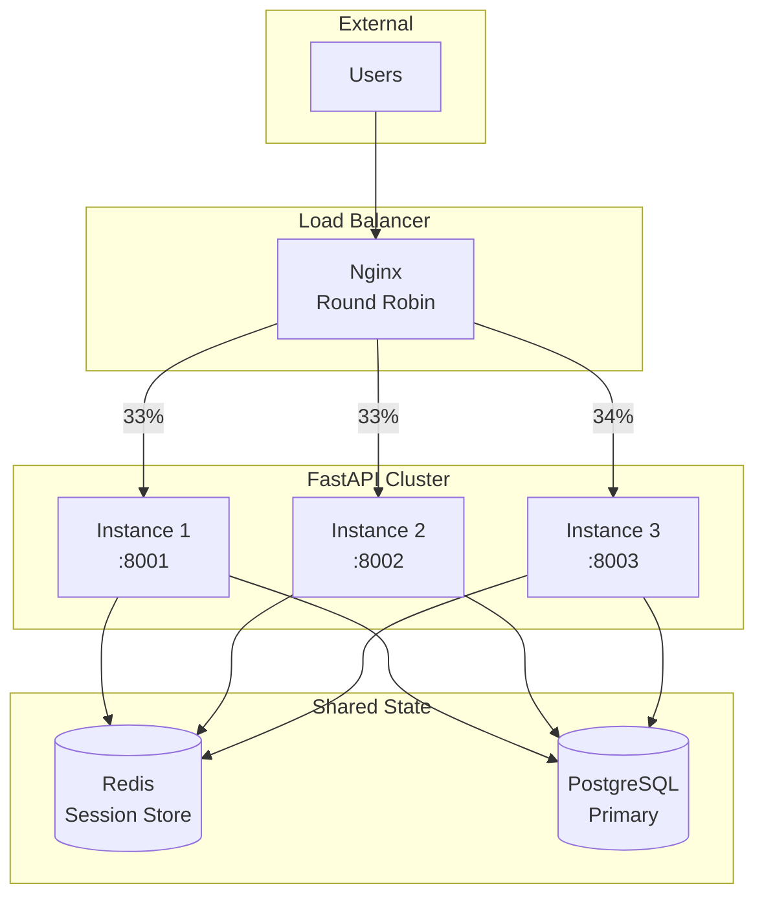

### Read/Write Splitting

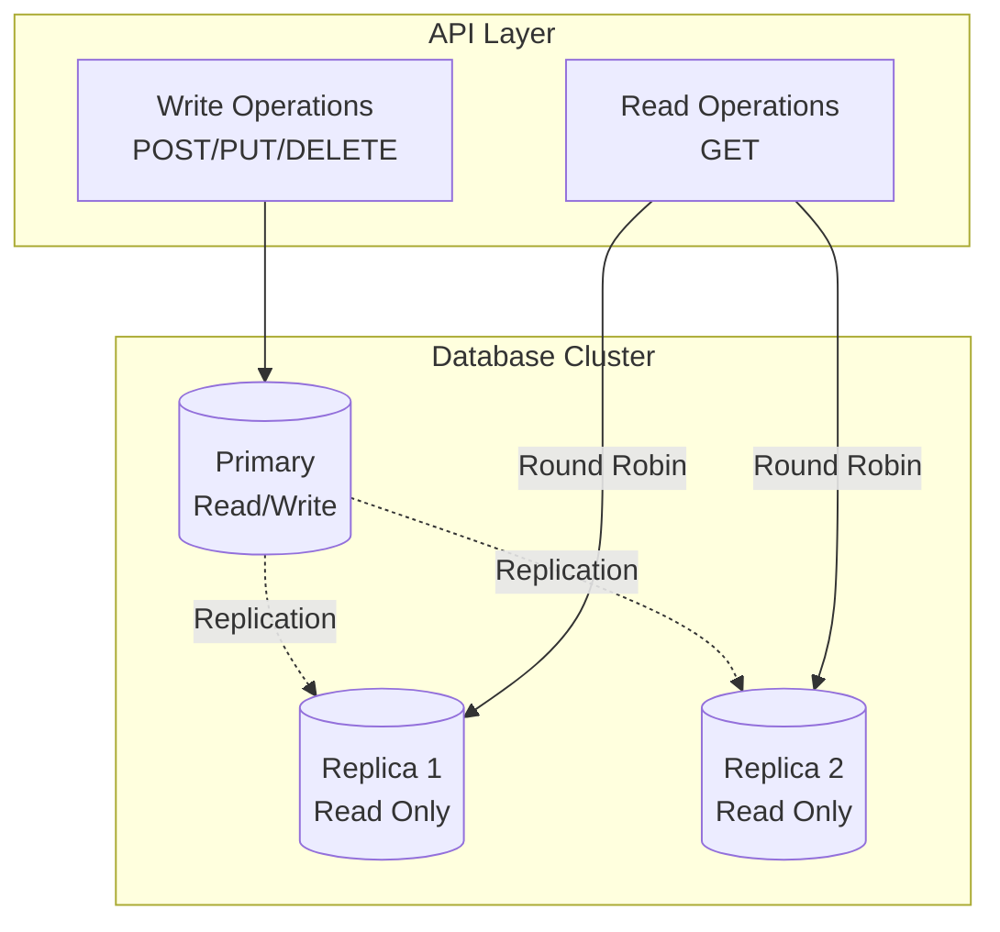

---

## 10. Security Layers

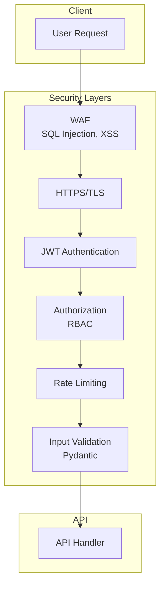

---

## 11. Monitoring & Observability

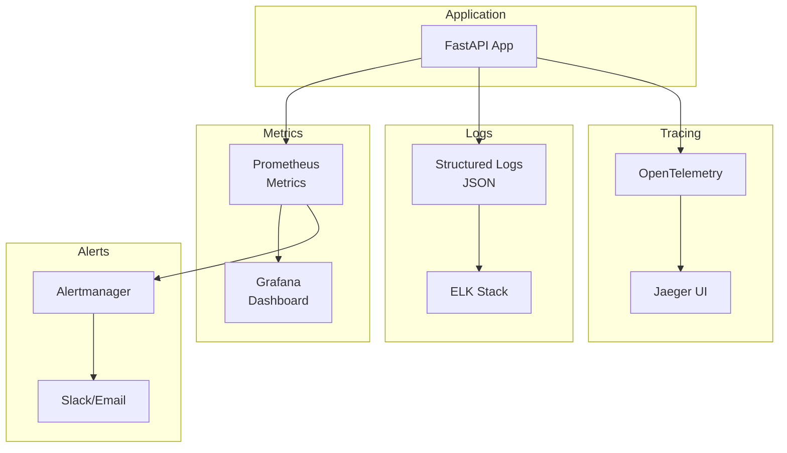

**Key Metrics**:
- Request rate (req/sec)
- Response time (p50, p95, p99)
- Error rate (4xx, 5xx)
- Database connection pool
- Cache hit rate

---

## 12. Deployment Architecture

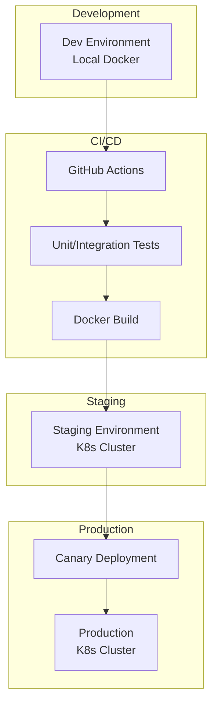

---

## 13. Technology Stack

| Layer | Technology | Purpose |
|-------|-----------|---------|
| **Framework** | FastAPI 0.104+ | Async REST API |
| **Validation** | Pydantic 2.5+ | Type safety, validation |
| **Server** | Uvicorn 0.24+ | ASGI server |
| **Database** | PostgreSQL 15+ | Primary data store |
| **Search** | Elasticsearch 8.0+ | Full-text search |
| **Cache** | Redis 7.0+ | Session, statistics |
| **ORM** | SQLAlchemy 2.0+ | Async ORM |
| **Migration** | Alembic 1.12+ | Schema migration |
| **Auth** | JWT + PassLib | Authentication |
| **Rate Limit** | Redis + FastAPI | Request throttling |
| **Monitoring** | Prometheus + Grafana | Metrics |
| **Logging** | Structlog | Structured logging |
| **Container** | Docker + K8s | Deployment |

---

## 14. Related Documents

- **API Design**: `D:\AI\claude01\Archive_Converter\docs\API_DESIGN.md`
- **UDM Schema**: `D:\AI\claude01\Archive_Converter\src\models\udm.py`
- **Export PRD**: `D:\AI\claude01\Archive_Converter\prds\PRD-0005-EXPORT-AGENT.md`
