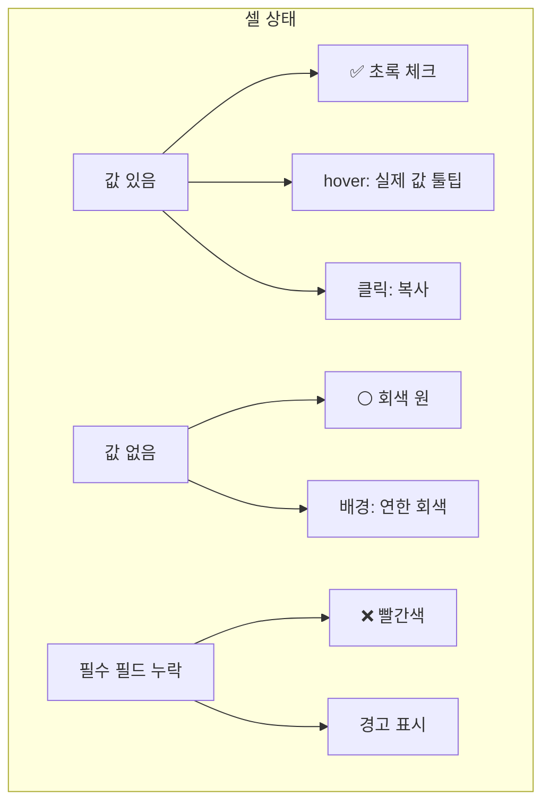
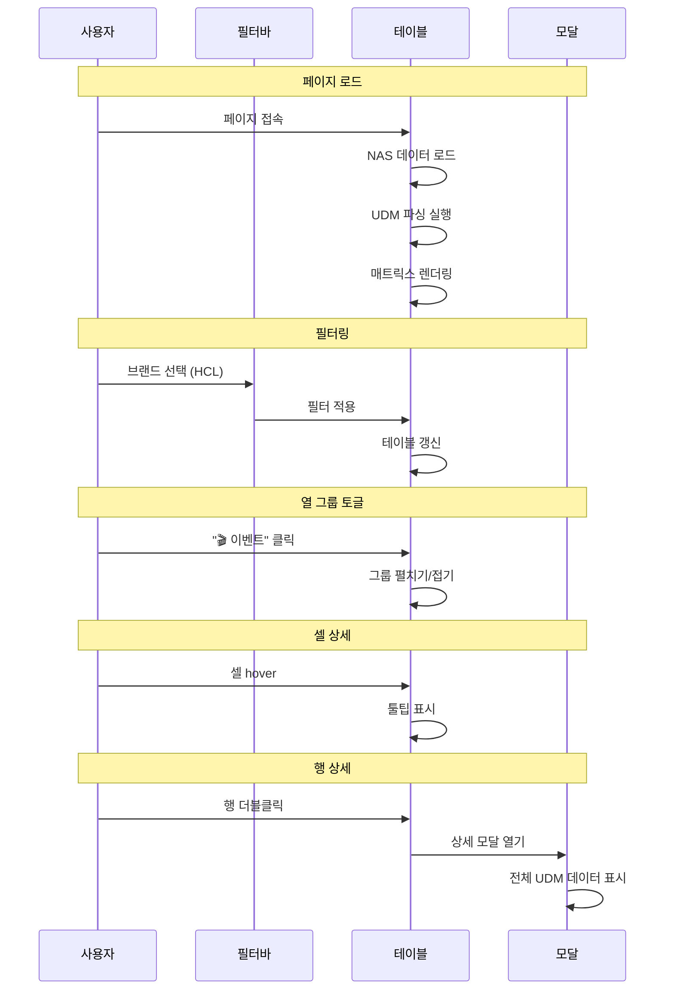
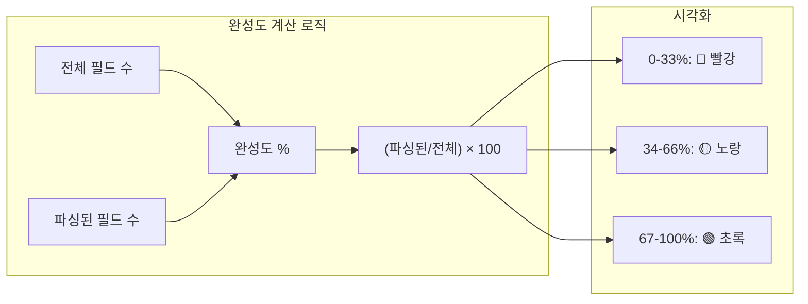
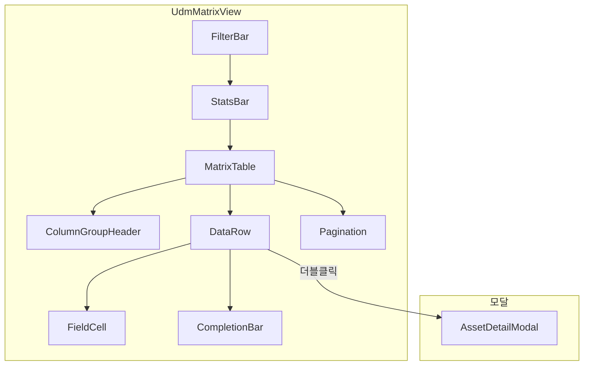

# PRD-0012: UDM Matrix View

## 개요

NAS 파일들의 UDM 파싱 현황을 **매트릭스 테이블** 형태로 한눈에 확인할 수 있는 뷰어

### 문제점 (현재)
- 개별 파일을 하나씩 선택해서 확인해야 함
- 전체 데이터 현황 파악이 어려움
- 어떤 필드가 많이/적게 파싱되는지 알 수 없음

### 해결책
- **행 = 파일**, **열 = UDM 필드** 형태의 매트릭스 테이블
- 셀마다 파싱 여부 시각화 (✅/⚪)
- 열 그룹화로 대량 필드 관리
- 필터/정렬로 빠른 탐색

---

## 화면 구조

### 전체 레이아웃

```
┌─────────────────────────────────────────────────────────────────────────────┐
│                           UDM Matrix View                                   │
│                    NAS 파일별 UDM 파싱 현황 매트릭스                          │
├─────────────────────────────────────────────────────────────────────────────┤
│ ┌─────────────────────────────────────────────────────────────────────────┐ │
│ │ [필터바]                                                                 │ │
│ │ 브랜드: [All ▼]  연도: [All ▼]  완성도: [All ▼]  [검색...]  [새로고침] │ │
│ └─────────────────────────────────────────────────────────────────────────┘ │
├─────────────────────────────────────────────────────────────────────────────┤
│ ┌─────────────────────────────────────────────────────────────────────────┐ │
│ │ [통계바]                                                                 │ │
│ │ 총 156개 파일 | 평균 완성도 42% | 브랜드 8개 | Segments 있는 파일 23개   │ │
│ └─────────────────────────────────────────────────────────────────────────┘ │
├─────────────────────────────────────────────────────────────────────────────┤
│                                                                             │
│                         [매트릭스 테이블]                                    │
│                                                                             │
│  ┌────────────────────────────────────────────────────────────────────────┐ │
│  │  (아래 상세 설계 참조)                                                  │ │
│  └────────────────────────────────────────────────────────────────────────┘ │
│                                                                             │
├─────────────────────────────────────────────────────────────────────────────┤
│ [◀ 이전]  페이지 1 / 10  [다음 ▶]                              50개씩 보기 │
└─────────────────────────────────────────────────────────────────────────────┘
```

### 매트릭스 테이블 상세

```
┌──────────────────┬─────────────────────────────────┬─────────────────────────────────┬────────┐
│                  │      📁 기본정보 [−]            │      🎬 이벤트 [+]              │        │
│     파일명       ├────────┬────────┬───────┬──────┼─────────────────────────────────┤ 완성도 │
│                  │  uuid  │  path  │ type  │ size │         (접힌 상태)              │        │
├──────────────────┼────────┼────────┼───────┼──────┼─────────────────────────────────┼────────┤
│ HCL_S15_EP01.mp4 │   ✅   │   ✅   │  ✅   │  ✅  │              ▶                  │ 78%    │
│                  │        │        │ STREAM│ 8.5GB│                                 │ ████░░ │
├──────────────────┼────────┼────────┼───────┼──────┼─────────────────────────────────┼────────┤
│ WSOP_2024_ME.mp4 │   ✅   │   ✅   │  ✅   │  ⚪  │              ▶                  │ 45%    │
│                  │        │        │ STREAM│   -  │                                 │ ██░░░░ │
├──────────────────┼────────┼────────┼───────┼──────┼─────────────────────────────────┼────────┤
│ PAD_S14_EP05.mp4 │   ✅   │   ✅   │  ⚪   │  ⚪  │              ▶                  │ 32%    │
│                  │        │        │   -   │   -  │                                 │ █░░░░░ │
└──────────────────┴────────┴────────┴───────┴──────┴─────────────────────────────────┴────────┘
```

### 열 그룹 펼친 상태

```
┌──────────┬────────────────────┬──────────────────────────────────────────────────────┬────────┐
│          │  📁 기본정보 [−]   │                   🎬 이벤트 [−]                       │        │
│  파일명  ├──────┬──────┬──────┼───────┬──────┬────────┬────────┬───────┬─────┬───────┤ 완성도 │
│          │ uuid │ path │ type │ brand │ year │  loc   │ season │  ep   │buyin│ game  │        │
├──────────┼──────┼──────┼──────┼───────┼──────┼────────┼────────┼───────┼─────┼───────┼────────┤
│ HCL_S15  │  ✅  │  ✅  │  ✅  │  ✅   │  ✅  │   ✅   │   ✅   │  ✅   │  ⚪ │  ⚪   │  78%   │
│          │      │      │STREAM│  HCL  │ 2024 │  L.A.  │   15   │   1   │  -  │   -   │ ████░░ │
├──────────┼──────┼──────┼──────┼───────┼──────┼────────┼────────┼───────┼─────┼───────┼────────┤
│ WSOP_ME  │  ✅  │  ✅  │  ✅  │  ✅   │  ✅  │   ✅   │   ⚪   │  ⚪   │ ✅  │  ✅   │  65%   │
│          │      │      │STREAM│ WSOP  │ 2024 │  L.V.  │   -    │   -   │ 10K │  NLH  │ ███░░░ │
└──────────┴──────┴──────┴──────┴───────┴──────┴────────┴────────┴───────┴─────┴───────┴────────┘
```

---

## 열 그룹 정의

```mermaid
graph LR
    subgraph "열 그룹 구조"
        A["📁 기본정보"] --> A1[asset_uuid]
        A --> A2[file_name]
        A --> A3[file_path]
        A --> A4[asset_type]
        A --> A5[file_size]

        B["🎬 이벤트"] --> B1[brand]
        B --> B2[year]
        B --> B3[event_type]
        B --> B4[location]
        B --> B5[venue]
        B --> B6[event_number]
        B --> B7[buyin_usd]
        B --> B8[game_variant]

        C["📺 시즌"] --> C1[season]
        C --> C2[episode]
        C --> C3[episode_title]

        D["🎯 플래그"] --> D1[is_final_table]
        D --> D2[is_high_roller]
        D --> D3[is_super_high_roller]

        E["⚙️ 기술사양"] --> E1[fps]
        E --> E2[resolution]
        E --> E3[duration_sec]
        E --> E4[codec]

        F["📝 시트연동"] --> F1[segments]
        F --> F2[tournament_name]
        F --> F3[project_tag]
    end
```



### 그룹별 상세

| 그룹 | 필드 수 | 소스 | 기본 상태 |
|------|---------|------|-----------|
| 📁 기본정보 | 5개 | NAS 경로 | **펼침** |
| 🎬 이벤트 | 8개 | NAS 경로/파일명 | 접힘 |
| 📺 시즌 | 3개 | 파일명 | 접힘 |
| 🎯 플래그 | 3개 | 파일명 | 접힘 |
| ⚙️ 기술사양 | 4개 | NAS/수동 | 접힘 |
| 📝 시트연동 | 3개 | Google Sheets | 접힘 |

---

## 셀 표시 규칙



### 셀 디자인

```
┌─────────────────────────────────────────────────────────────┐
│  값 있음 (✅)                                               │
│  ┌─────────┐                                                │
│  │   ✅    │  배경: bg-green-50                             │
│  │  WSOP   │  텍스트: 값 미리보기 (truncate)                │
│  └─────────┘  Hover: 전체 값 툴팁                           │
├─────────────────────────────────────────────────────────────┤
│  값 없음 (⚪)                                               │
│  ┌─────────┐                                                │
│  │   ⚪    │  배경: bg-gray-50                              │
│  │    -    │  텍스트: "-" 또는 빈칸                         │
│  └─────────┘                                                │
├─────────────────────────────────────────────────────────────┤
│  필수 누락 (❌)                                             │
│  ┌─────────┐                                                │
│  │   ❌    │  배경: bg-red-50                               │
│  │ 필수!   │  테두리: border-red-300                        │
│  └─────────┘                                                │
└─────────────────────────────────────────────────────────────┘
```

---

## 인터랙션 흐름



---

## 완성도 계산



### 완성도 바 디자인

```
완성도 78%:  ████████░░░░  (초록)
완성도 45%:  █████░░░░░░░  (노랑)
완성도 25%:  ███░░░░░░░░░  (빨강)
```

---

## 필터 옵션

| 필터 | 옵션 |
|------|------|
| **브랜드** | All, WSOP, HCL, PAD, MPP, WPT, EPT... |
| **연도** | All, 2025, 2024, 2023... |
| **완성도** | All, 높음(67%+), 중간(34-66%), 낮음(0-33%) |
| **Asset Type** | All, STREAM, SUBCLIP, MASTER... |
| **Segments** | All, 있음, 없음 |

---

## 컴포넌트 구조



---

## 기술 고려사항

### 성능 최적화
- **가상 스크롤**: 대량 데이터 처리 (react-virtual 또는 자체 구현)
- **열 가상화**: 펼친 열만 렌더링
- **메모이제이션**: useMemo로 파싱 결과 캐싱

### 반응형
- **좁은 화면**: 열 그룹 기본 접힘
- **넓은 화면**: 열 그룹 펼침 허용

---

## 구현 우선순위

| 순서 | 기능 | 중요도 |
|------|------|--------|
| 1 | 기본 매트릭스 테이블 | 필수 |
| 2 | 열 그룹 접기/펼치기 | 필수 |
| 3 | 완성도 바 | 필수 |
| 4 | 필터링 | 높음 |
| 5 | 정렬 | 중간 |
| 6 | 페이지네이션 | 중간 |
| 7 | 상세 모달 | 낮음 |
| 8 | 가상 스크롤 | 낮음 (데이터 많을 때) |

---

## 예상 결과

### Before (현재)
- 파일 하나씩 선택해서 확인
- 전체 현황 파악 불가

### After (매트릭스 뷰)
- **한눈에** 전체 파일의 파싱 현황 확인
- **열 그룹**으로 관심 필드만 펼쳐서 확인
- **완성도**로 데이터 품질 즉시 파악
- **필터**로 특정 브랜드/연도 빠르게 탐색
